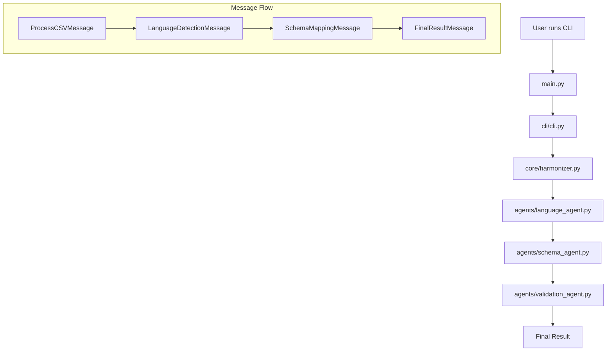

# Smart International Sales Data Harmonizer - Architecture

This document describes the organized architecture of the Smart International Sales Data Harmonizer project.

## 📁 Project Structure

```
mapping_demo/
├── 📦 agents/                 # AI Agent implementations
│   ├── __init__.py           # Agents package exports
│   ├── language_agent.py     # Language Detection & Translation Agent
│   ├── schema_agent.py       # Schema Mapping Agent
│   └── validation_agent.py   # Data Validation & Enhancement Agent
│
├── 🏗️ core/                   # Core business logic
│   ├── __init__.py           # Core package exports
│   ├── models.py             # Data models and message types
│   └── harmonizer.py         # Main orchestrator
│
├── 🖥️ cli/                    # Command-line interface
│   ├── __init__.py           # CLI package exports
│   └── cli.py                # CLI commands and interface
│
├── 🧪 tests/                  # Test files
│   ├── __init__.py           # Tests package
│   └── test_basic.py         # Basic functionality tests
│
├── 📜 scripts/                # Utility scripts
│   └── activate.sh           # Environment activation helper
│
├── 📚 docs/                   # Documentation
│   └── ARCHITECTURE.md       # This file
│
├── 🎯 main.py                 # Main entry point
├── 📋 requirements.txt        # Python dependencies
├── 🔧 .env                    # Environment variables
├── 📄 .env.example           # Environment template
├── 📖 README.md              # Main documentation
└── 📊 sample_sales_data.csv  # Sample multi-language CSV
```

## 🏗️ Architecture Overview

### Layer 1: Core (`core/`)
**Purpose**: Contains the fundamental business logic and data models.

- **`models.py`**: Defines all data structures and message types used for agent communication
- **`harmonizer.py`**: Main orchestrator that coordinates the agent workflow

### Layer 2: Agents (`agents/`)
**Purpose**: Contains the specialized AI agents that process the data.

- **`language_agent.py`**: Detects languages and translates content
- **`schema_agent.py`**: Maps columns to target schema using fuzzy matching + AI
- **`validation_agent.py`**: Validates, fixes, and enriches the mapped data

### Layer 3: Interface (`cli/`)
**Purpose**: Provides user interaction layer.

- **`cli.py`**: Command-line interface with commands for processing files

### Layer 4: Tests (`tests/`)
**Purpose**: Ensures system reliability and correctness.

- **`test_basic.py`**: Basic import and functionality tests

### Layer 5: Utilities (`scripts/`, `docs/`)
**Purpose**: Support files for development and documentation.

## 🔄 Data Flow



## 📦 Package Dependencies

### Core Dependencies
- **`core/models.py`**: No internal dependencies (pure data models)
- **`core/harmonizer.py`**: Depends on `agents.*` and `core.models`

### Agent Dependencies
- **`agents/language_agent.py`**: Depends on `core.models`
- **`agents/schema_agent.py`**: Depends on `core.models`
- **`agents/validation_agent.py`**: Depends on `core.models`

### Interface Dependencies
- **`cli/cli.py`**: Depends on `core.harmonizer`
- **`main.py`**: Depends on `cli.cli`

## 🔧 Key Design Patterns

### 1. Message-Passing Architecture
- Agents communicate through typed Pydantic messages
- No direct dependencies between agents
- Loose coupling enables easy testing and modification

### 2. Layer Separation
- **Core**: Business logic (models, orchestration)
- **Agents**: Specialized AI processing
- **CLI**: User interface
- **Tests**: Quality assurance

### 3. Factory Pattern
- `create_harmonizer()` function creates and initializes the system
- Agents are created through AutoGen's factory system

### 4. Dependency Injection
- Agents receive their dependencies (OpenAI client) during initialization
- No hardcoded dependencies within agents

## 🚀 Usage Patterns

### Development Usage
```bash
# Run tests
python tests/test_basic.py

# Check system status
python main.py check

# Create sample data
python main.py demo

# Process data
python main.py harmonize sample_sales_data.csv
```

### Import Patterns
```python
# Core models
from core.models import ProcessCSVMessage, LanguageDetection

# Agents (usually not needed for end users)
from agents import LanguageDetectionAgent

# Main functionality
from core.harmonizer import create_harmonizer
```

## 🔍 Benefits of This Architecture

1. **Modularity**: Each component has a single responsibility
2. **Testability**: Easy to test individual components in isolation
3. **Maintainability**: Clear separation makes changes easier
4. **Scalability**: Easy to add new agents or modify existing ones
5. **Reusability**: Core components can be reused in other projects
6. **Clarity**: Logical organization makes the codebase easier to understand

## 🛠️ Development Guidelines

### Adding New Agents
1. Create agent class in `agents/` directory
2. Add message handlers using `@message_handler` decorator
3. Update `agents/__init__.py` to export the new agent
4. Modify `core/harmonizer.py` to include the new agent

### Adding New Message Types
1. Define message class in `core/models.py`
2. Use Pydantic `BaseModel` or Python `@dataclass`
3. Update `core/__init__.py` exports
4. Update agent handlers to process new message types

### Adding New CLI Commands
1. Add command function to `cli/cli.py`
2. Use Click decorators for command definition
3. Follow existing patterns for error handling and output